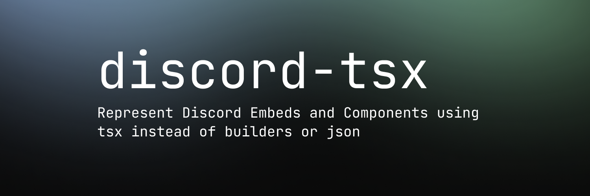

# discord-tsx



Represent Discord Embeds and Components using TSX instead of raw JSON or long builder chains.

## Install

```bash
npm install discord-tsx
```

```bash
pnpm add discord-tsx
```

```bash
yarn add discord-tsx
```

## Use in another project

`discord-tsx` is a normal npm library. In your own project:

1. Install `discord-tsx`
2. Set TS JSX runtime config
3. Write TSX with `discord-tsx` tags
4. Recommended: run postbuild transform to bake payload objects into built JS

### TS config

```json
{
  "compilerOptions": {
    "jsx": "react-jsx",
    "jsxImportSource": "discord-tsx",
    "moduleResolution": "nodenext"
  }
}
```

`moduleResolution: "nodenext"` (or `node16`/`bundler`) is important so `discord-tsx/jsx-runtime` resolves correctly.

## Postbuild mode (Highly Recommended)

After `tsc`, run the transformer:

```bash
discord-tsx-postbuild ./dist
```

This rewrites compiled `_jsx/_jsxs` trees rooted at `<DiscordEmbed>` / `<DiscordComponent>` into object literals directly in emitted JS.

Example:

`<Text>hello</Text>` becomes:

```ts
{ type: 10, content: "hello" }
```

Suggested scripts in consumer project:

```json
{
  "scripts": {
    "build": "tsc",
    "postbuild": "discord-tsx-postbuild ./dist"
  }
}
```

## Runtime mode

TSX is converted to object payloads when code executes.

```tsx
import { DiscordEmbed, Title, Description } from "discord-tsx";

const name = "World";
const embed = (
  <DiscordEmbed color="#ffffff">
    <Title>Discord Tsx Builder Testing</Title>
    <Description>Hello {name}</Description>
  </DiscordEmbed>
);

// embed is plain JSON-like data at runtime
```

## Tag reference

All tags are exported from `discord-tsx`.

### Embed root

Use `<DiscordEmbed>` as the root.

Props:

- `color?: string | number` (`"#ffffff"` or `16777215`)

Supported children:

- `<Title>`
- `<Description>`
- `<Url>`
- `<Timestamp>`
- `<Color>`
- `<Author>`
- `<Footer>`
- `<Image>`
- `<Thumbnail>`
- `<Fields>`
- `<Field>`

### Embed tags

`<Title>`:

- Children text -> `title`

`<Description>`:

- Children text -> `description`

`<Url>`:

- `url` prop or children text -> `url`

`<Timestamp>`:

- `value` prop or children text -> `timestamp`

`<Color>`:

- `value` prop or children text -> `color` (hex strings are converted to int)

`<Image>`:

- `url` prop or children text -> `image.url`

`<Thumbnail>` (inside embed):

- `url` or `src` prop or children text -> `thumbnail.url`

`<Author>`:

- Props: `name`, `iconUrl` (`icon_url` also accepted), `url`
- Children alternatives: `<AuthorName>`, `<AuthorIconUrl>`, `<AuthorUrl>`

`<Footer>`:

- Props: `text`, `iconUrl` (`icon_url` also accepted)
- Children alternatives: `<FooterText>`, `<FooterIconUrl>`

`<Fields>`:

- Grouping wrapper for `<Field>`

`<Field>`:

- Props: `name`, `value`, `inline`
- Or children: `<FieldName>`, `<FieldValue>`
- Requires both name and value

### Components root

Use `<DiscordComponent>` as the root. It returns:

- `{ components: [...] }` for legacy-only layouts
- `{ components: [...], flags: 32768 }` when v2 components are used

If you are setting components in a response, set the components and the flags separately.
`interaction.reply({ components: components.components, flags: components.flags })`

### Legacy components

`<ActionRow>`:

- Children: interactive components only (`<Button>` or any select menu)
- Select rule: a select menu must be the only child in the row
- Button rule: max 5 buttons in the row

`<Button>`:

- Props: `customId`, `style`, `label`, `emoji`, `url`, `disabled`, `skuId`
- If `label` is omitted, children text becomes label
- `style` accepts number or one of: `primary`, `secondary`, `success`, `danger`, `link`, `premium`

`<StringSelectMenu>`:

- Props: `customId`, `placeholder`, `minValues`, `maxValues`, `disabled`
- Options can come from `options` prop array or `<Option>` children

`<UserSelectMenu>`, `<RoleSelectMenu>`, `<MentionableSelectMenu>`, `<ChannelSelectMenu>`:

- Props: `customId`, `placeholder`, `minValues`, `maxValues`, `disabled`, `defaultValues`
- `<ChannelSelectMenu>` also supports `channelTypes`

`<Option>`:

- Props: `label`, `value`, `description`, `emoji`, `default`
- Used by `<StringSelectMenu>`

### V2 components

`<Container>`:

- Props: `accentColor` (`accent_color` also accepted), `spoiler`
- Children supported: `<Text>`, `<Section>`, `<MediaGallery>`, `<File>`, `<Separator>`, `<ActionRow>`, `<Button>`, select menus
- If `<Button>`/select appears directly, it is wrapped into an action row automatically

`<Text>`:

- Children text -> `{ type: 10, content: ... }`

`<Section>`:

- Needs at least one text block
- Text via direct text, `<Text>`, or `<SectionText>`
- Accessory via `<SectionAccessory>` with one child: `<Button>` or `<Thumbnail>`

`<Thumbnail>` (inside section accessory or top-level v2):

- Props: `url` or `src`, optional `description`, `spoiler`

`<MediaGallery>`:

- Props: `items` array (optional)
- Or `<MediaItem>` children

`<MediaItem>`:

- Props: `url` or `src`, optional `description`, `spoiler`

`<File>`:

- Props: `url` or `src`

`<Separator>`:

- Props: `divider`, `spacing`

### Top-level children allowed in `<DiscordComponent>`

- Legacy: `<ActionRow>`
- V2: `<Container>`, `<Section>`, `<Text>`, `<Thumbnail>`, `<MediaGallery>`, `<File>`, `<Separator>`
- Interactive tags at top-level (`<Button>` or select menus) are auto-wrapped into action rows and treated as v2

See full usage in:

- [examples/tag-showcase.tsx](./examples/tag-showcase.tsx)

## How Babel is handled

You do not need Babel config in your app.

- Your app still builds with `tsc` (or your normal TS pipeline).
- `discord-tsx` runtime mode needs no Babel.
- `discord-tsx-postbuild` internally uses Babel parser/traverse/generator APIs to parse emitted JS and rewrite only the Discord TSX runtime call trees.
- Those Babel packages are regular runtime dependencies of `discord-tsx`, so running the CLI in another project works after install.

So: no `.babelrc`, no Babel plugin setup, no manual AST wiring in your project.

## Comparison (raw JSON vs builders vs discord-tsx)

See:

- [examples/raw-json.ts](./examples/raw-json.ts)
- [examples/discordjs-builders.md](./examples/discordjs-builders.md)
- [examples/runtime-vs-postbuild.tsx](./examples/runtime-vs-postbuild.tsx)
- [examples/README.md](./examples/README.md)

## Validation rules

- Select menus inside `<ActionRow>` must be the only child in that row.
- V2 components automatically set message flag `32768` (`IsComponentsV2`).

## Local example commands

```bash
yarn examples:check
yarn examples:runtime
yarn examples:postbuild
```

## Tests

```bash
yarn test:runtime
yarn test:build
yarn test
```

